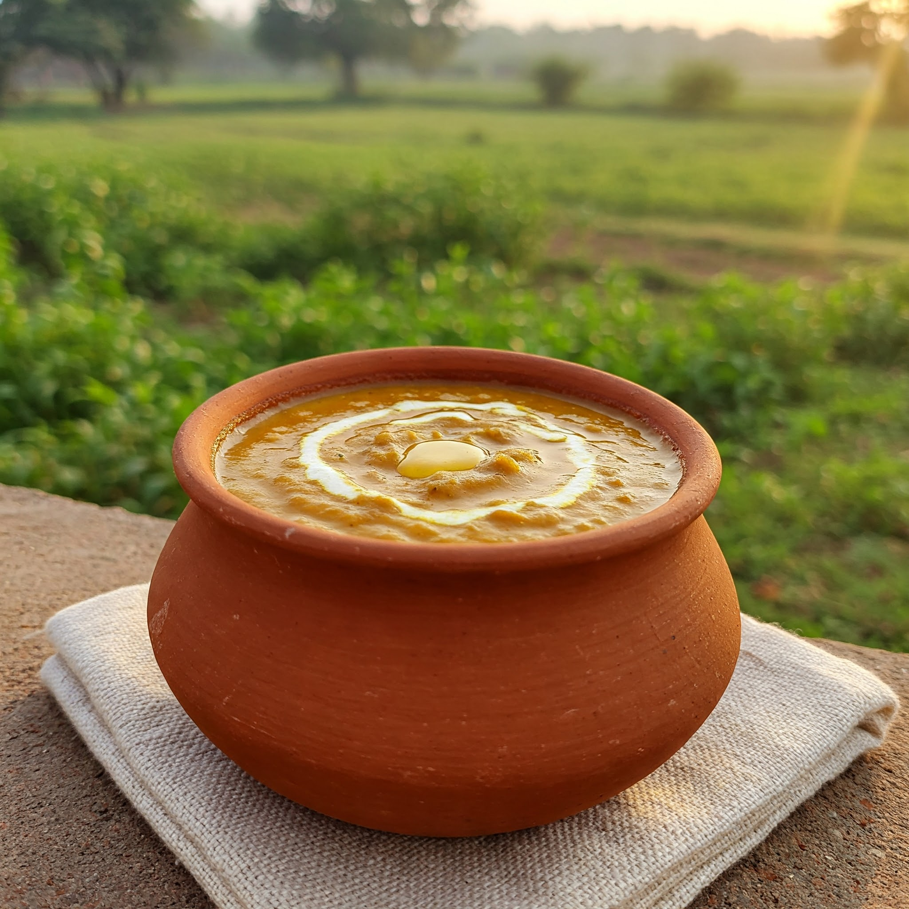
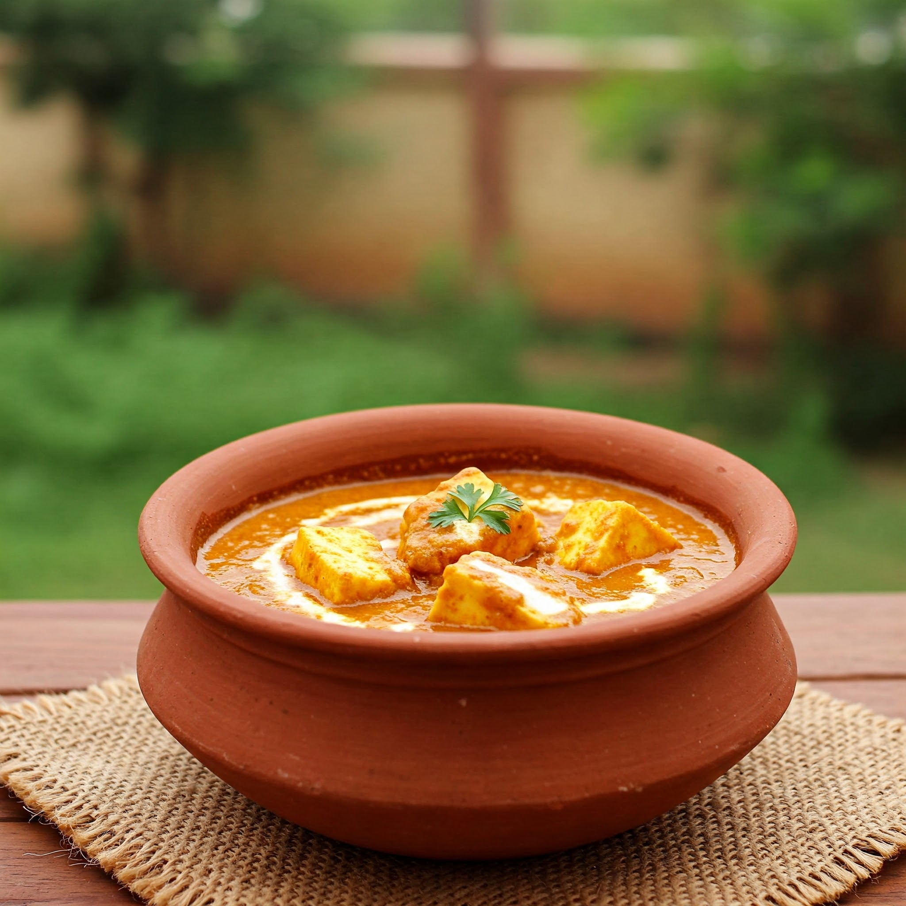
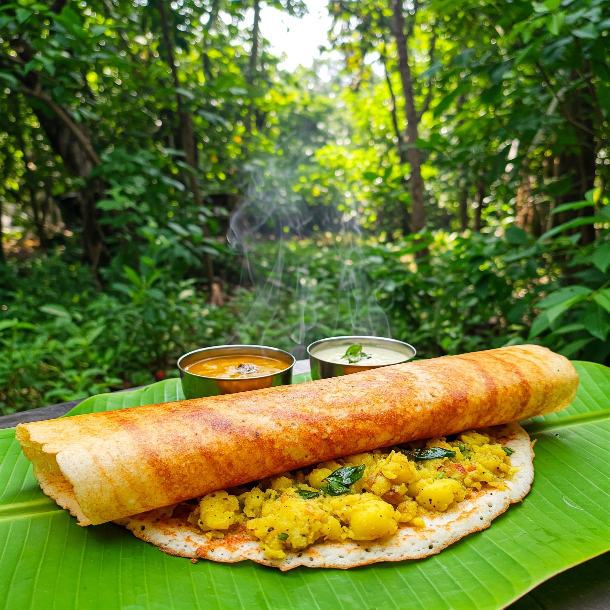
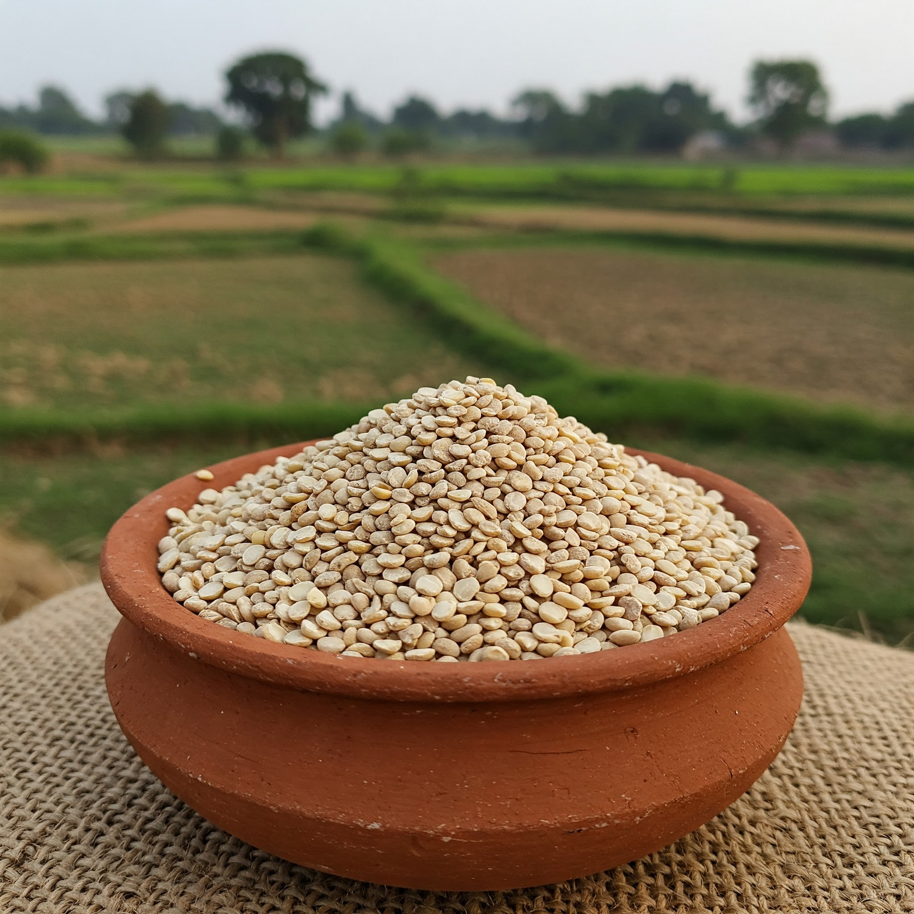
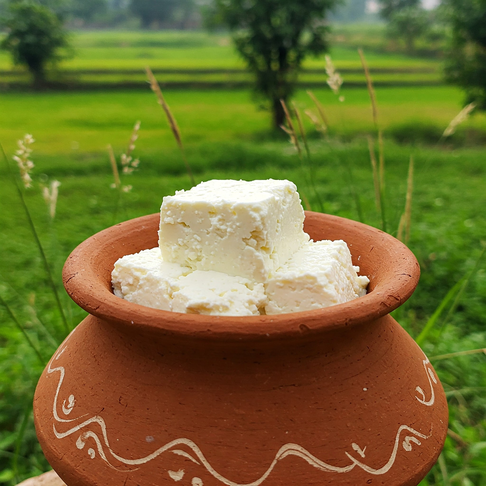
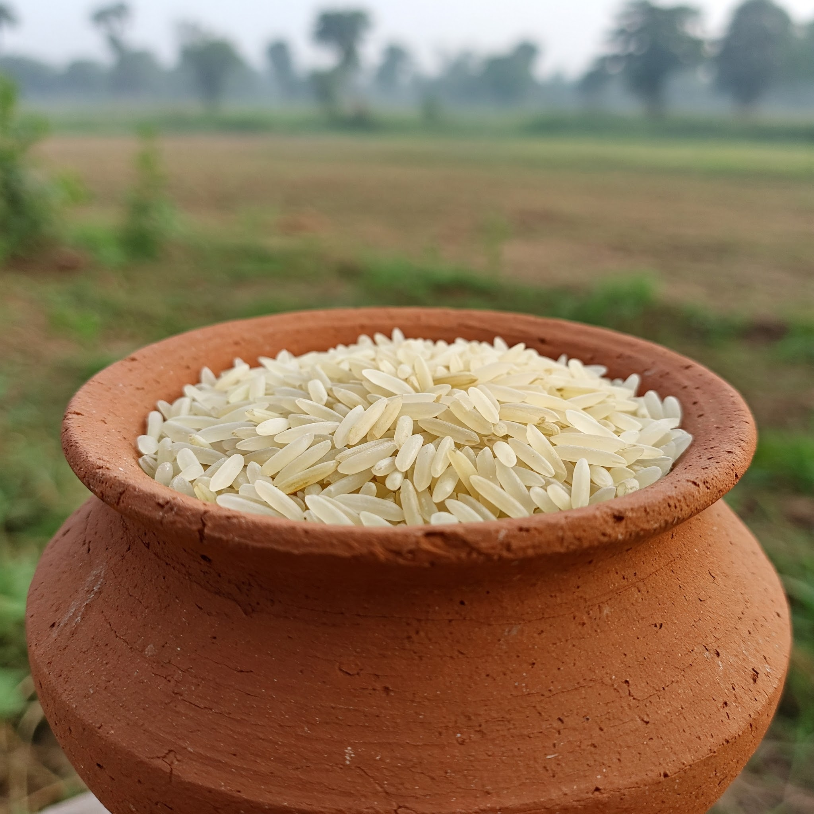
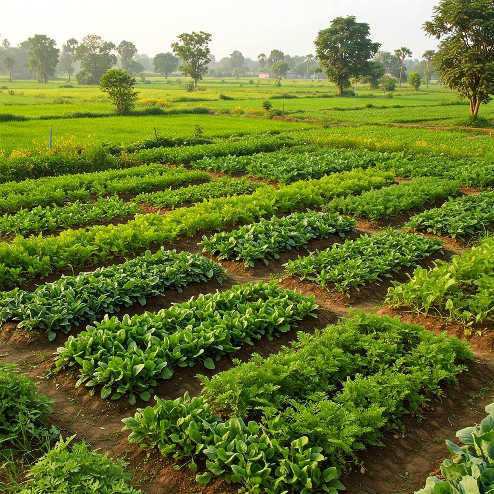
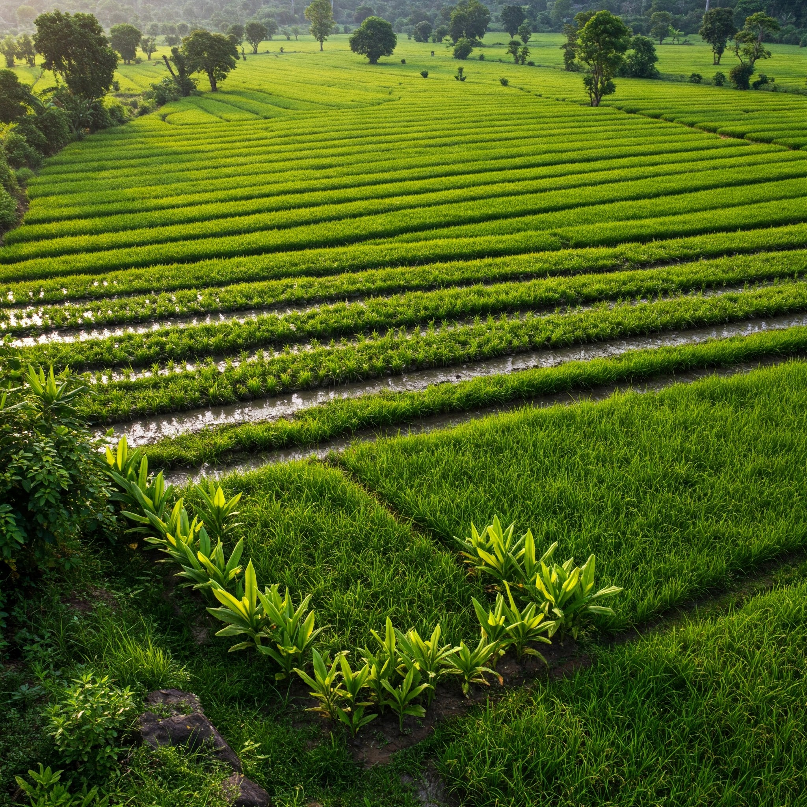
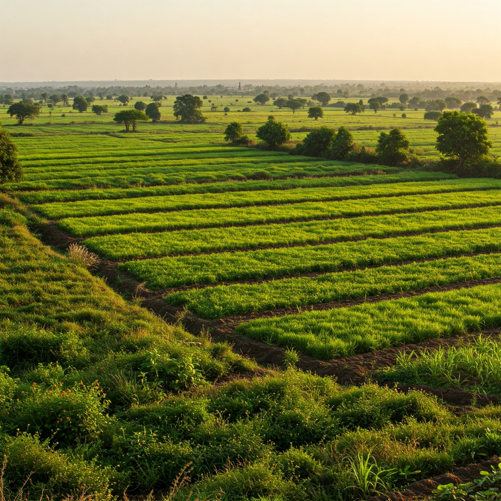

<!DOCTYPE html>
<html lang="en">
<head>
    <meta charset="UTF-8">
    <meta name="viewport" content="width=device-width, initial-scale=1.0">
    <meta name="description" content="Pure Veg भारतीय Restaurant">
    <title>Pure Veg भारतीय Restaurant</title>
    <link rel="stylesheet" href="style.css">
    
</head>
<body>

    <!-- Navigation Bar -->
    <header>
        

            <h1 style="color: white; font-size: 24px; margin: 0;">Pure Veg भारतीय Restaurant</h1>
        

        <nav>
            <ul>
                <li><a href="#home">Home</a></li>
                <li><a href="#menu">Menu</a></li>
                <li><a href="#quality">Quality and Ingredients</a></li>
                <li><a href="#gallery">Gallery</a></li>
                <li><a href="#about">About</a></li>
                <li><a href="#contact">Contact</a></li>
            </ul>
        </nav>
    </header>

    <!-- Home Section -->
    <section id="home" class="hero">
        

            <h2>Welcome to Pure Veg भारतीय Restaurant!</h2>
            
Experience the authentic taste of India with a variety of delicious vegetarian dishes!

            <button onclick="window.location.href='#menu'">Browse Menu</button>
        

    </section>

    <!-- Menu Section -->
    <section id="menu">
        <h2>Our Menu</h2>
        

            

                

                    
                    <h3>Dal Makhani</h3>
                    
Rich and creamy black lentils cooked with butter and spices.

                

                

                    
                    <h3>Authentic and Original A2 Milk Paneer</h3>
                    
Soft paneer cubes made from A2 milk, served in a spiced spinach gravy.

                

                

                    
                    <h3>Masala Dosa</h3>
                    
Crispy dosa filled with a spiced potato mix, served with chutneys.

                

            

        

    </section>

    <!-- Quality and Ingredients Section -->
    <section id="quality">
        <h2>Quality and Ingredients</h2>
        

            

                

                    
                    <h3>Unpolished Dal</h3>
                    
Enjoy the perfect balance of taste and nutrition in every dish.

                

                

                    
                    <h3>Authentic A2 Milk Paneer</h3>
                    
Made from pure A2 milk, ensuring freshness and quality.

                

                

                    
                    <h3>Organic and Pure Rice</h3>
                    
Grown naturally to preserve its authentic flavor and texture.

                

            

            <!-- New big images section -->
            

                

                    
                    <h3>Organic Farm</h3>
                    
Sustainable and eco-friendly.

                

                

                    
                    <h3>Our Commitment to Quality</h3>
                    
We use all ingredients from our own farm.

                

                

                    
                    <h3>Pure Farm Produce</h3>
                    
Freshly harvested produce for a healthy dining experience.

                

            

        

    </section>

    <!-- Gallery Section -->
    <section id="gallery">
        <h2>Gallery</h2>
        

            

                
                
Experience a sustainable and eco-friendly ambience.

            

            

                
                
Immerse yourself in a serene and natural environment

            

            

                
                
Relish the delicious flavors of Indian cuisine amidst lush greenery and a serene atmosphere

            

            

                
                
Pure and Natural Environment

            

            

                
                
Refreshing and Comfortable Ambience

            

        

    </section>

    <!-- About Section -->
    <section id="about">
        <h2>About Us</h2>
        
We are a family-owned restaurant serving pure vegetarian Indian food. Our mission is to bring the authentic and diverse flavors of Indian cuisine to your plate with quality ingredients and a focus on sustainability. Whether you're a fan of rich gravies, crispy dosas, or refreshing chaats, we have something for everyone.

    </section>

    <!-- Contact Section -->
    <section id="contact">
        <h2>Contact Us</h2>
        
We'd love to hear from you! Whether you have a question about our detailed menu or want to book a reservation, feel free to reach out.

        <form id="contact-form">
            <input type="text" name="name" placeholder="Your Name" required>
            <input type="email" name="email" placeholder="Your Email" required>
            <textarea name="message" placeholder="Your Message" required></textarea>
            <button type="submit">Send Message</button>
        </form>
    </section>

    <!-- Footer -->
    <footer>
        
&copy; 2025 Pure Veg भारतीय Restaurant. All rights reserved.

    </footer>

</body>
</html>

/* General Styles */
* {
    margin: 0;
    padding: 0;
    box-sizing: border-box;
    font-family: Arial, sans-serif;
}

body {
    background-color: #fff9f2;
    color: #333;
}

h1, h2 {
    font-size: 2em;
    color: #ebeef1;
}

p {
    font-size: 1em;
    line-height: 1.6;
}

/* Header */
header {
    display: flex;
    justify-content: space-between;
    align-items: center;
    padding: 20px;
    background-color: #2c3e50;
    color: white;
}

header .logo h1 {
    font-size: 2.5em;
}

.logo img {
    height: 25px; /* Adjust the height as needed */
    width: 400px; /* Maintain aspect ratio */
}

nav ul {
    list-style-type: none;
}

nav ul li {
    display: inline-block;
    margin-left: 20px;
}

nav ul li a {
    color: white;
    text-decoration: none;
    font-size: 1.1em;
}

/* Hero Section */
.hero {
    background-image: url('ChatGPT Image Apr 27, 2025, 06_29_33 PM.png'); /* Replace with the correct path if needed */
    background-size: cover;
    background-position: center;
    color: white;
    text-align: center;
    padding: 100px 0;
    position: relative;
}

.hero-text {
    position: relative;
    z-index: 2;
}

.hero::before {
    content: '';
    position: absolute;
    top: 0;
    left: 0;
    width: 100%;
    height: 100%;
    background-color: rgba(0, 0, 0, 0.5); /* Adds a dark overlay for better text visibility */
    z-index: 1;
}

.hero-text h2 {
    font-size: 3em;
}

.hero-text p {
    font-size: 1.2em;
    margin: 20px 0;
}

.hero button {
    background-color: #e74c3c;
    color: white;
    font-size: 1.2em;
    padding: 10px 20px;
    border: none;
    cursor: pointer;
}

/* Menu Section */
#menu {
    text-align: center;
    padding: 50px 20px;
    background-color: #f8f8f8;
}

#menu h2 {
    color: rgb(39, 37, 37); /* Changed the heading color to black */
}

.menu-items {
    display: flex;
    justify-content: space-around;
    margin-top: 30px;
}

.menu-item {
    width: 30%;
    background-color: #fff;
    box-shadow: 0 4px 8px rgba(0, 0, 0, 0.1);
    padding: 20px;
}

.menu-item img {
    width: 100%;
    border-radius: 8px;
}

.menu-item h3 {
    font-size: 1.5em;
    margin: 15px 0;
}

.menu-item p {
    font-size: 1em;
}

/* About Section */
#about {
    padding: 50px 20px;
    text-align: center;
    background-color: #eaf2f8;
}

#about h2, #contact h2 {
    color: #4a4a4a; /* Dark grey color */
}

/* Contact Section */
#contact {
    padding: 50px 20px;
    background-color: #f8f8f8;
}

#contact form {
    display: flex;
    flex-direction: column;
    align-items: center;
}

#contact input, #contact textarea {
    margin: 10px 0;
    padding: 12px;
    width: 300px;
    border-radius: 5px;
    border: 1px solid #ccc;
}

#contact button {
    padding: 12px 20px;
    background-color: #2c3e50;
    color: white;
    font-size: 1.1em;
    border: none;
    cursor: pointer;
}

/* Footer */
footer {
    background-color: #2c3e50;
    color: white;
    text-align: center;
    padding: 20px;
}

footer p {
    font-size: 1em;
}
/* Media Queries */

/* Add or modify the styles for the gallery heading */
#gallery h2 {
    color: #4a4a4a; /* Change the color to dark grey */
    text-align: center; /* Center the heading */
}

.gallery-items {
    display: flex; /* Use flexbox to arrange items horizontally */
    justify-content: space-around; /* Add space between items */
    flex-wrap: wrap; /* Allow wrapping if there are too many items */
    gap: 20px; /* Add spacing between items */
}

.gallery-item {
    flex: 1 1 calc(30% - 20px); /* Adjust width to 30% with spacing */
    text-align: center; /* Center-align text under images */
}

.gallery-item img {
    width: 100%; /* Make images responsive */
    border-radius: 8px; /* Optional: Add rounded corners */
}

#quality h2 {
    color: #2c2c2c; /* Darker grey shade */
    text-align: center;
}

#quality {
    background-color: #eaf2f8; /* Light beige background color */
    padding: 50px 20px; /* Add padding for spacing */
}

.quality-items {
    display: flex; /* Arrange items in a horizontal row */
    justify-content: space-around; /* Add space between items */
    align-items: center; /* Align items vertically */
    flex-wrap: wrap; /* Allow wrapping if needed on smaller screens */
    gap: 20px; /* Add spacing between items */
}

.quality-item {
    text-align: center; /* Center-align text and images */
    max-width: 200px; /* Optional: Set a max width for each item */
}

.quality-item img {
    margin-top: 10px; /* Add spacing between text and image */
    width: 100px; /* Ensure consistent image size */
    height: auto;
}

// Simple form submission handler (just for demonstration purposes)
document.getElementById("contact-form").addEventListener("submit", function(event) {
    event.preventDefault();
    alert("Thank you for your message! We will get back to you soon.");
});

